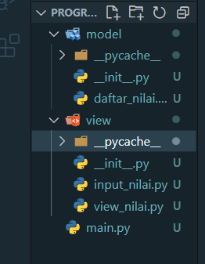
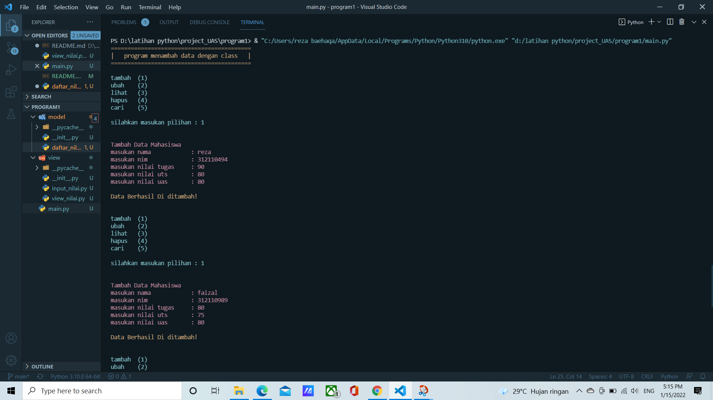
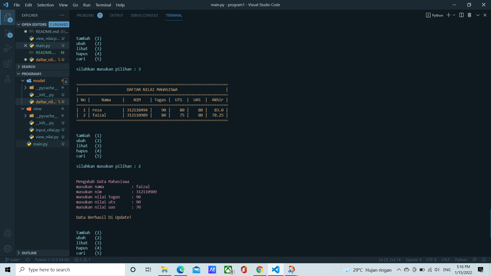
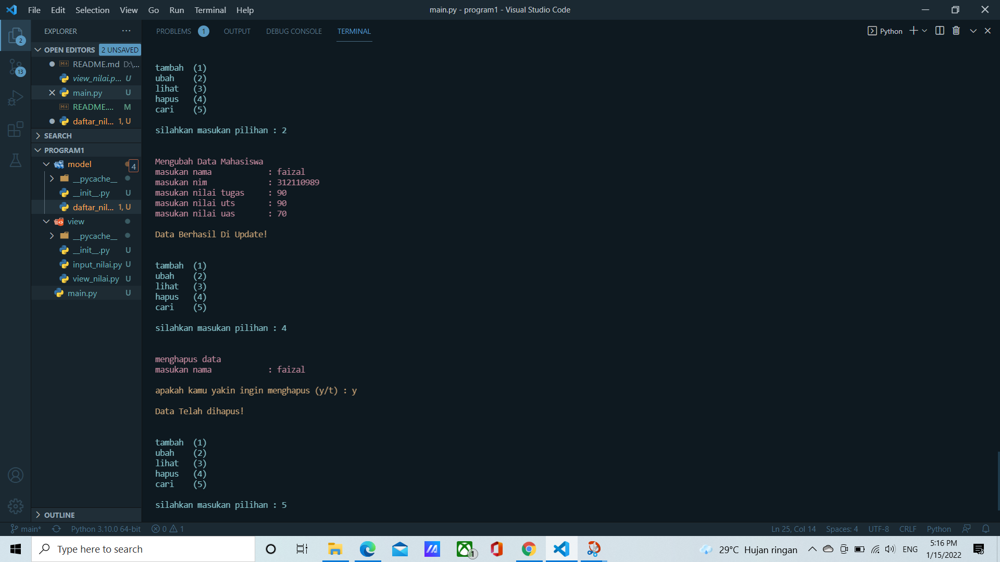

# project_UAS
```sh
Nama    : A. Reza Baehaqa Jamroni
Nim     : 312110494
Matkul  : Bahasa Perograman
```
### Struktur package dan model
<p>
### penjelasan

1. daftar_nilai.py berisi modul untuk: tambah, ubah, hapus, cari
### tambah
* Fungsi tambah untuk menambahkan data mahasiswa seperti nama, nim, nilai tugas, nilai uts dan nilai uas dengan menggunakan fungsi nama_input(), nim_input(), tugas_input(), uts_input(), uas_input(). Data yang diinput akan masuk ke dalam direktori dt={}
```sh
def tambah(self):
        print('\n\033[95mTambah Data Mahasiswa')
        input_nama  = nama()
        input_nim   = nim()
        input_tugas = tugas()
        input_uts   = uts()
        input_uas   = uas()
        input_akhir = akhir()
        dt[input_nama]=input_nim,input_tugas,input_uts,input_uas,input_akhir
        print("\n\033[93mData Berhasil Di ditambah!\n")
```
### ubah
* Fungsi ubah untuk mengubah data mahasiswa berdasarkan nama, lalu masukkan data yang ingin diubah.
```sh
def ubah(self):
        print('\n\033[95mMengubah Data Mahasiswa')
        input_nama  = nama()                                                         
        if input_nama in dt.keys():                              
            input_nim   = nim()
            input_tugas = tugas()
            input_uts   = uts()
            input_uas   = uas()
            input_akhir = akhir()
            dt[input_nama]=input_nim,input_tugas,input_uts,input_uas,input_akhir                      
            print("\n\033[93mData Berhasil Di Update!\n")
```
### hapus
* Fungsi hapus untuk menghapus data mahasiswa berdasarkan nama
``` sh
    def hapus(self):
        print('\n\033[95mmenghapus data')
        input_nama = nama()                                                        
        if input_nama in dt.keys():
            z=input('\n\033[93mapakah kamu yakin ingin menghapus (y/t) : ')                                                              
            if z == "y":
                del dt[input_nama]                                                                   
                print("\n\033[93mData Telah dihapus!\n")

            if z == "t":
                print('\n\033[93mKembali ke menu utama')

        else:
            print("\033[93mData Mahasiswa Tidak Ada\n")
```
### cari
* Fungsi cari  untuk mencari data mahasiswa berdasarkan nama
```sh
    def cari_data(self):
        ('+---{  MASUKAN NAMA DARI DATA YANG AKAN DI CARI  }--+\n')
        input_nama  = nama()
        view.cari(self)
```
### keluar 
* fungsi keluar untuk keluar dari program dan menampilkan data diri yang saya bikin
```sh
    def keluar(self):
        print('\n\033[97m=====terimakasih=====\n')
        print(21*'=')
        print("Nama\t: A. Reza Baehaqa Jamroni\nKelas\t: TI.21.C5\nNIM\t: 312110494")
        print(21*'=')
```

2. view_nilai.py berisikan untuk menampilkan data yang telah kita input yaitu berupa daftar nilai mahasiswa
```sh
from model.daftar_nilai import *
class melihat():
    def lihat(self):
        if dt.items():                                                                     
            print("\n\033[93m==================================================================")
            print("|                     DAFTAR NILAI MAHASISWA                     |")
            print("==================================================================")
            print("| No |     Nama     |    NIM    | Tugas |  UTS  |  UAS  |  Akhir |")
            print("==================================================================")
            i = 0
            for x in dt.items():
                i += 1
                print("| {6:2} | {0:12s} | {1:9s} | {2:5} | {3:5} | {4:5} | {5:6} |".format(x[0], x[1][0], x[1][1], x[1][2], x[1][3], x[1][4], i))  
            print("==================================================================\n")
        else:
            print("\n\033[93m==================================================================")
            print("|                     DAFTAR NILAI MAHASISWA                     |")
            print("==================================================================")
            print("| No |     Nama     |    NIM    | Tugas |  UTS  |  UAS  |  Akhir |")
            print("==================================================================")
            print("|                        TIDAK ADA DATA!                         |")
            print("==================================================================\n")
```
3. input_nilai.py berisi modul untuk: input_data yang meminta pengguna memasukkan data yang terdiri dari nama, nim, nilai tugas, nilai uts, dan nilai uas
```sh
def nama():
    global a
    a = input('masukan nama\t\t: ')
    return a
def nim():
    global b
    b= input('masukan nim\t\t: ')
    return b
def tugas():
    global c
    c=int(input('masukan nilai tugas\t: '))
    return c
def uts():
    global d
    d=int(input('masukan nilai uts\t: '))
    return d
def uas():
    global e
    e=int(input('masukan nilai uas\t: '))
    return e
def akhir():
    global ahir
    ahir=(c)*0.30 + (d)*0.35 + (e)*0.35
    return ahir
```
4. main.py berisi program utama (menu pilihan yang memanggil semua menu yang ada).<p>

Import package view dan model agar dapat dieksekusi di main.py
```sh
from model.daftar_nilai import *
from view.view_nilai import melihat 
```
Terdapat pilihan menu yang terdiri dari tambah data, ubah data, lihat data, hapus data, cari data dan menu untuk keluar dari program
```sh
while True:
    data=daftarNilai()
    em=melihat()
    print('\n\033[96mtambah\t(1)\nubah\t(2)\nlihat\t(3)\nhapus\t(4)\ncari\t(5)')                                                                                     
    c = input("\nsilahkan masukan pilihan : ")
    print()
    if (c=="1"):
        data.tambah()
    elif (c=="2"):
        data.ubah()
    elif (c=="3"):
        em.lihat()
    elif (c=="4"):
        data.hapus()
    elif (c=="5"):
        data.cari_data()
    else:
        data.keluar()
        break
```
### output program
berikut adalah contoh tampilan hasil dari output yang saya bikin
<p>
<p>
<p>


